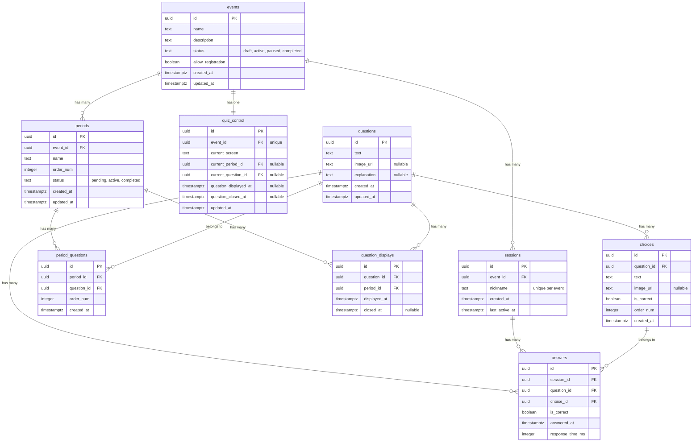

# データベース設計

## 概要
Supabase (PostgreSQL) のテーブル設計とRow Level Security (RLS) の設定。

---

## ER図



---

## テーブル定義

### events（イベント）

クイズ大会全体を管理するテーブル。

**カラム:**
- `id` (uuid, PK): イベントID
- `name` (text): イベント名
- `description` (text): 説明
- `status` (text): 状態 (`draft`, `active`, `paused`, `completed`)
- `allow_registration` (boolean): 新規参加を許可するか
- `created_at` (timestamptz): 作成日時
- `updated_at` (timestamptz): 更新日時

**インデックス:**
- `idx_events_status` on `status`

**RLS:**
- 読み取り: 全員可能
- 更新: Admin（Basic認証で保護）

---

### periods（ピリオド）

イベント内のセクションを管理するテーブル。

**カラム:**
- `id` (uuid, PK): ピリオドID
- `event_id` (uuid, FK): イベントID
- `name` (text): ピリオド名
- `order_num` (integer): 実施順序
- `status` (text): 状態 (`pending`, `active`, `completed`)
- `created_at` (timestamptz): 作成日時
- `updated_at` (timestamptz): 更新日時

**制約:**
- UNIQUE(`event_id`, `order_num`)

**インデックス:**
- `idx_periods_event_id` on `event_id`
- `idx_periods_status` on `status`

---

### questions（問題）

クイズ問題を保存するテーブル。

**カラム:**
- `id` (uuid, PK): 問題ID
- `text` (text): 問題文
- `image_url` (text, nullable): 問題画像URL
- `explanation` (text, nullable): 解説
- `created_at` (timestamptz): 作成日時
- `updated_at` (timestamptz): 更新日時

---

### choices（選択肢）

問題の選択肢を保存するテーブル。

**カラム:**
- `id` (uuid, PK): 選択肢ID
- `question_id` (uuid, FK): 問題ID
- `text` (text): 選択肢テキスト
- `image_url` (text, nullable): 選択肢画像URL
- `is_correct` (boolean): 正解かどうか
- `order_num` (integer): 表示順序
- `created_at` (timestamptz): 作成日時

**制約:**
- UNIQUE(`question_id`, `order_num`)

**インデックス:**
- `idx_choices_question_id` on `question_id`

---

### period_questions（ピリオドと問題の紐付け）

どのピリオドにどの問題が含まれるかを管理するテーブル。

**カラム:**
- `id` (uuid, PK)
- `period_id` (uuid, FK): ピリオドID
- `question_id` (uuid, FK): 問題ID
- `order_num` (integer): ピリオド内での問題順序
- `created_at` (timestamptz): 作成日時

**制約:**
- UNIQUE(`period_id`, `question_id`)
- UNIQUE(`period_id`, `order_num`)

**インデックス:**
- `idx_period_questions_period_id` on `period_id`
- `idx_period_questions_question_id` on `question_id`

---

### sessions（セッション）

ユーザーのセッションとニックネームを管理するテーブル。

**カラム:**
- `id` (uuid, PK): セッションID
- `event_id` (uuid, FK): イベントID
- `nickname` (text): ユーザーのニックネーム
- `created_at` (timestamptz): 作成日時
- `last_active_at` (timestamptz): 最終アクティブ日時

**制約:**
- UNIQUE(`event_id`, `nickname`) - イベント内でニックネーム重複不可

**インデックス:**
- `idx_sessions_event_id` on `event_id`
- `idx_sessions_nickname` on (`event_id`, `nickname`)

**RLS:**
- 読み取り: 全員可能
- 作成: 全員可能
- Admin: 全セッション参照可能

---

### answers（回答）

ユーザーの回答を記録するテーブル。

**カラム:**
- `id` (uuid, PK): 回答ID
- `session_id` (uuid, FK): セッションID
- `question_id` (uuid, FK): 問題ID
- `choice_id` (uuid, FK): 選択肢ID
- `is_correct` (boolean): 正解かどうか
- `answered_at` (timestamptz): 回答日時
- `response_time_ms` (integer): 回答時間（ミリ秒）

**制約:**
- UNIQUE(`session_id`, `question_id`) - 1問につき1回答のみ

**インデックス:**
- `idx_answers_session_id` on `session_id`
- `idx_answers_question_id` on `question_id`
- `idx_answers_answered_at` on `answered_at`

**RLS:**
- ユーザー: 自分の回答のみ作成・参照可能
- Admin: 全回答参照可能

---

### quiz_control（クイズ進行制御）

現在の画面状態を管理するテーブル（singleton: イベントごとに1レコード）。

**カラム:**
- `id` (uuid, PK)
- `event_id` (uuid, FK): イベントID
- `current_screen` (text): 現在の画面 (`waiting`, `question`, `answer`, `period_result`, `final_result`)
- `current_period_id` (uuid, FK, nullable): 現在のピリオドID
- `current_question_id` (uuid, FK, nullable): 現在の問題ID
- `question_displayed_at` (timestamptz, nullable): 問題表示時刻
- `question_closed_at` (timestamptz, nullable): 問題締切時刻
- `updated_at` (timestamptz): 更新日時

**制約:**
- UNIQUE(`event_id`) - イベントごとに1レコードのみ

**インデックス:**
- `idx_quiz_control_event_id` on `event_id`

**RLS:**
- 読み取り: 全員可能
- 更新: Adminのみ

---

### question_displays（問題表示記録）

各問題の表示・締切時刻を記録するテーブル（未回答時間計算用）。

**カラム:**
- `id` (uuid, PK)
- `question_id` (uuid, FK): 問題ID
- `period_id` (uuid, FK): ピリオドID
- `displayed_at` (timestamptz): 表示時刻
- `closed_at` (timestamptz, nullable): 締切時刻

**制約:**
- UNIQUE(`period_id`, `question_id`) - ピリオド内で問題ごとに1レコード

**インデックス:**
- `idx_question_displays_period_id` on `period_id`
- `idx_question_displays_question_id` on `question_id`

---

## ビュー（集計用）

### period_rankings（ピリオドランキング）

ピリオドごとのユーザーランキングを生成するビュー。

**カラム:**
- `event_id`: イベントID
- `period_id`: ピリオドID
- `session_id`: セッションID
- `nickname`: ニックネーム
- `correct_count`: 正解数
- `total_response_time_ms`: 合計回答時間（ミリ秒）
- `answered_count`: 回答数

**ソート順:** `correct_count DESC`, `total_response_time_ms ASC`

---

### event_rankings（全体ランキング）

イベント全体のユーザーランキングを生成するビュー。

**カラム:**
- `event_id`: イベントID
- `session_id`: セッションID
- `nickname`: ニックネーム
- `correct_count`: 全体正解数
- `total_response_time_ms`: 全体合計回答時間（ミリ秒）
- `answered_count`: 全体回答数

**ソート順:** `correct_count DESC`, `total_response_time_ms ASC`

---

## 関数（ヘルパー）

### get_unanswered_time

未回答ユーザーの回答時間を計算する関数。

**引数:**
- `p_question_id` (uuid): 問題ID
- `p_period_id` (uuid): ピリオドID

**戻り値:** integer（ミリ秒）

未回答の場合、問題表示時刻から締切時刻までの時間を返す。

---

## マイグレーション戦略

### 初期スキーマ
- `infra/supabase/migrations/20251019000000_initial_schema.sql`

### マイグレーションの実行

ローカル環境:
```bash
supabase db reset
```

本番環境:
```bash
supabase db push
```

---

最終更新: 2025年10月19日
